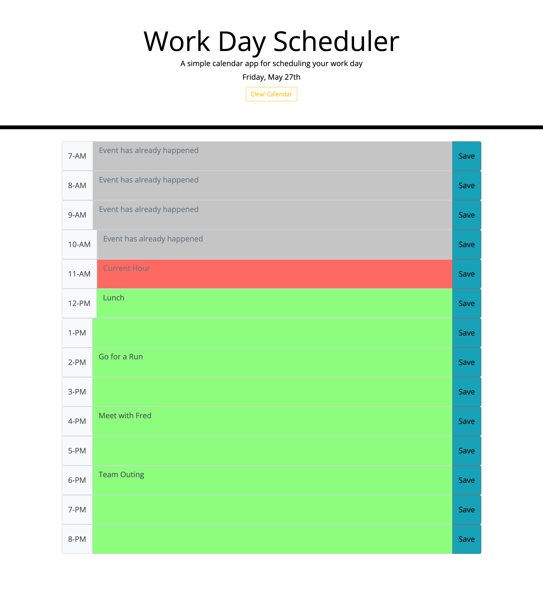

# Work Day Calendar!

## Table of contents

- [Overview](#overview)
  - [The challenge](#the-challenge)
  - [User Story](#user-story)
  - [Acceptance Criteria](#acceptance-criteria)
  - [Links](#links)
- [My process](#my-process)
  - [Built with](#built-with)
  - [What I learned](#what-i-learned)

## Overview

### The challenge

Create a simple calendar application that allows a user to save events for each hour of the day. This app will run in the browser and feature dynamically updated HTML and CSS powered by jQuery.

### User Story

    AS AN employee with a busy schedule
    I WANT to add important events to a daily planner
    SO THAT I can manage my time effectively

### Acceptance Criteria

    GIVEN I am using a daily planner to create a schedule
    WHEN I open the planner
    THEN the current day is displayed at the top of the calendar
    WHEN I scroll down
    THEN I am presented with time blocks for standard business hours
    WHEN I view the time blocks for that day
    THEN each time block is color-coded to indicate whether it is in the past, present, or future
    WHEN I click into a time block
    THEN I can enter an event
    WHEN I click the save button for that time block
    THEN the text for that event is saved in local storage
    WHEN I refresh the page
    THEN the saved events persist

### Screenshot

### Links

- Solution URL: [https://github.com/dnsnguy08/work_day_calendar](https://github.com/dnsnguy08/work_day_calendar)
- Live Site URL: [https://dnsnguy08.github.io/work_day_calendar/](https://dnsnguy08.github.io/work_day_calendar/)

## My process

### Built with
- HTML
- CSS
- JQuery

### What I learned
Using JQuery, I was able build a work day scheduler that dynamically updates based on user inputs.
The calendar utilizes the browser's local storage to save events until explicitly cleared.
